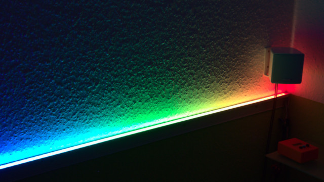
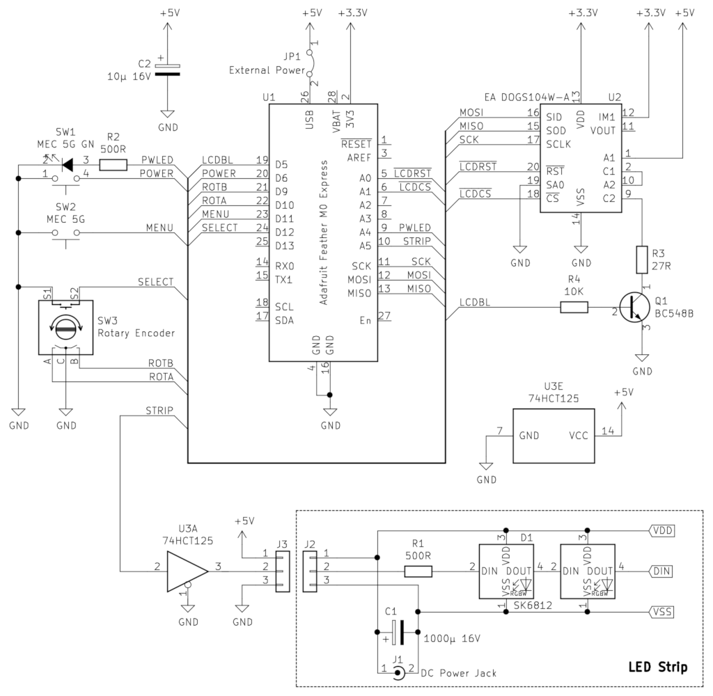

# Wall Bias Lighting

This is a DIY wall bias lighting.

It uses an RGBW LED strip (based on SK6812 LEDs), where every LED can be addressed individually.

# Construction

The lighting consists of a controller module based on an Adafruit [Feather M0 Express](https://www.adafruit.com/product/3403), and a separate RGBW LED strip.

The controller consists of a few components and can be assembled on one-layer strip grid boards. The LED strip only needs a condenser and a resistor, all of them can be wired without a PCB. Just keep the wire between the controller module and LED strip as short as possible.

There is a [blog article](https://shred.zone/blog/page/436/premium-wall-bias-lighting-part-1.html) about the construction that might be helpful.

## Bill of Material

* U1: Adafruit Feather M0 Express
* U2: LCD Display 4x10 with backlight (Electronic Assembly [EA DOGS104W-A](https://www.lcd-module.com/produkte/dog.html) with EA LED36X28A amber backlight, or a similar LCD with SSD1803A controller)
* U3: 74 HCT 125
* Q1: BC 548 B
* D1...: SK6812 based RGBW LED strip, 60 LEDs per meter (NeoPixel compatible)
* R1: 500 Ω
* R2: 500 Ω
* R3: 27 Ω (or matching the LCD display backlight LEDs at 5 V)
* R4: 10 kΩ
* C1: 1000 µF, 16 V
* C2: 10 µF, 16 V
* SW1: Switch with integrated green LED
* SW2: Switch
* SW3: Rotary encoder with switch
* JP1: Jumper. If closed, the Feather is powered by the power brick. Always open the jumper *before* connecting the Feather via USB!
* J1: DC power jack that matches the 5 V power brick
* J2, J3: 3 wire connectors for connecting the LED strip with the controller
* 5 V power brick with at least 18 W per LED strip meter
* Wires and a prototype PCB

In the `case` directory, you will find OpenSCAD files of a 3D printed case for your convenience.

# Programming

The Feather is programmed via the [Arduino IDE](https://www.arduino.cc/en/main/software).

First make sure that the [dependencies](#dependencies) are installed.

Then open the `lighting/lighting.ino` file in the IDE. Locate the line having `#define LED_COUNT`, and set the number of LEDs in your LED strip there. If you forget this step, some of your LEDs may stay black or behave erratic.

Remove the jumper JP1, then connect the Feather to your computer via USB. After that, you can build and install the `lighting` sketch via USB.

> **WARNING:** You must always remove the jumper JP1 *before* connecting the Feather to an USB master, to avoid damage to the USB port!

## Adding new Effects

The sketch comes with a number of predefined effects. You can always add new effects and change existing effects. Just edit `lighting/Effect.h` and `lighting/Effect.cpp` accordingly.

If you add or remove effects, update the `effectList` array in `lighting/lighting.ino` accordingly.

## Dependencies

Please make sure these libraries are installed via the Arduino library manager:

* Adafruit NeoPixel
* Adafruit DMA neopixel library
* MD_REncoder (by majic Designs)

# Usage

When turned on, the LED strip will show an effect. The display shows the name of the current effect, and a bargraph of the brightness.

With the rotary encoder, you can change the brightness. By pressing the encoder switch, the selected brightness value is applied.

Press the menu button to browse the menu. Inside a menu, you can change the value with the rotary encoder, and select your choice by pressing the encoder button. Your change will be discarded when you press the menu button, or wait for about 10 seconds.

These menus are available:

- **Effect**: You can change the lighting effect here.
- **Saturation**: Change the saturation of the colors here.
- **Color Temp**: Change the color temperature. White will appear warmer or cooler depending on the settings.

Use the power button to turn the lighting on or off. When turned off, the power button LED lights up, so you can locate it in a dark room.

# License

This work is licensed under a [Creative Commons Attribution-NonCommercial-ShareAlike license](https://creativecommons.org/licenses/by-nc-sa/4.0/).

> It is explicitly forbidden to sell the assembled hardware or pre-programmed DIY kits for profit. If you need an exemption, please get in contact with me.
